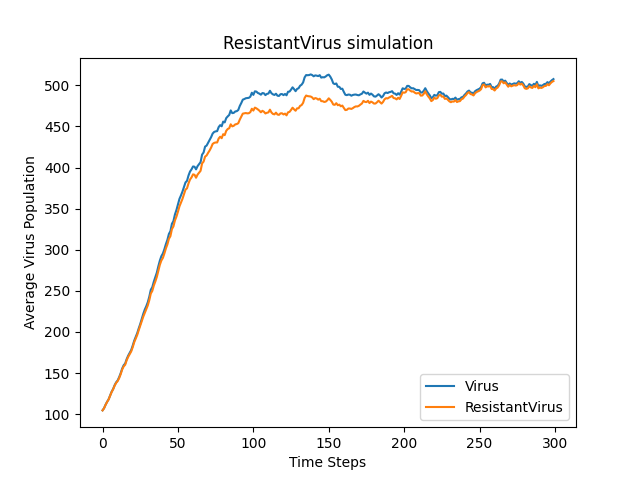
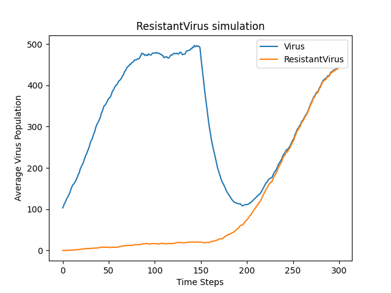

# Introduction to Computational Thinking and Data Science


### pset3
`Simulation with drugs`

- __Virus initially gluttagonol resistant__
```py
simulationWithDrug(
    numViruses = 100, 
    maxPop = 1000, 
    maxBirthProb = 0.1, 
    clearProb = 0.05, 
    resistances = {"guttagonol": True},
    mutProb = 0.005, 
    numTrials = 1
):
```


- __Virus initially NOT gluttagonol resistant__
```py
simulationWithDrug(
    numViruses = 100, 
    maxPop = 1000, 
    maxBirthProb = 0.1, 
    clearProb = 0.05, 
    resistances = {"guttagonol": False},
    mutProb = 0.005, 
    numTrials = 1
):
```
