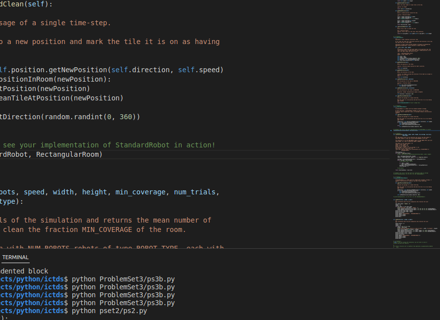
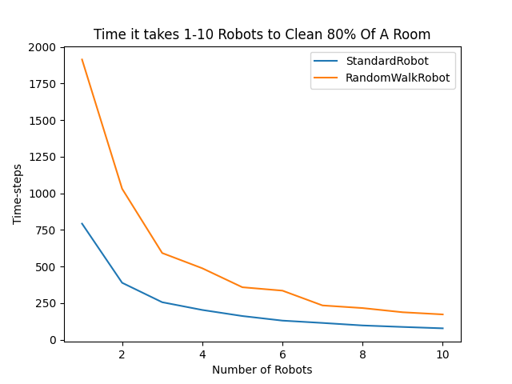
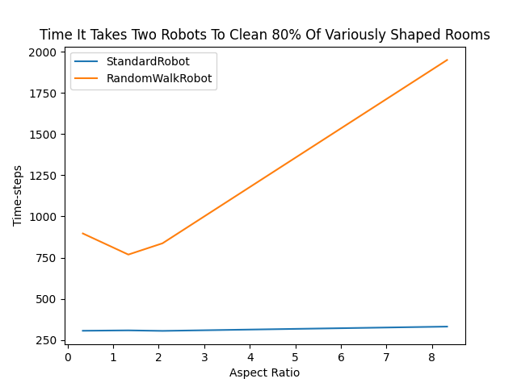
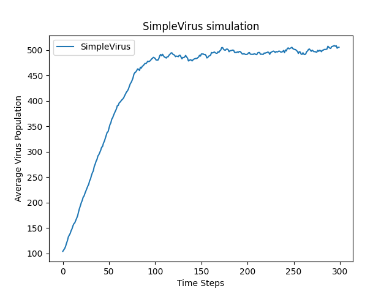
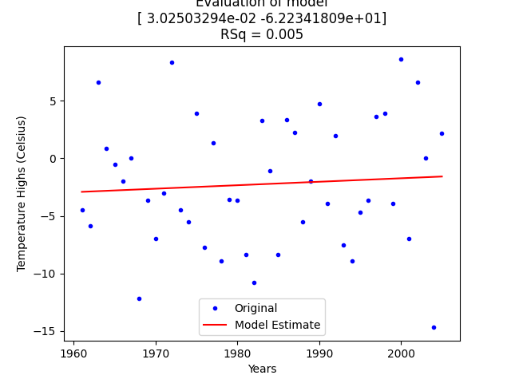
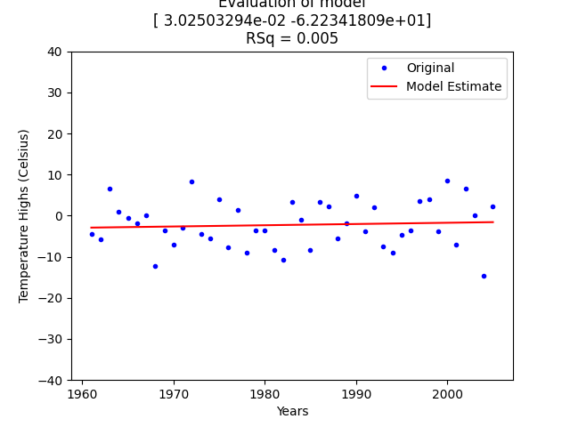
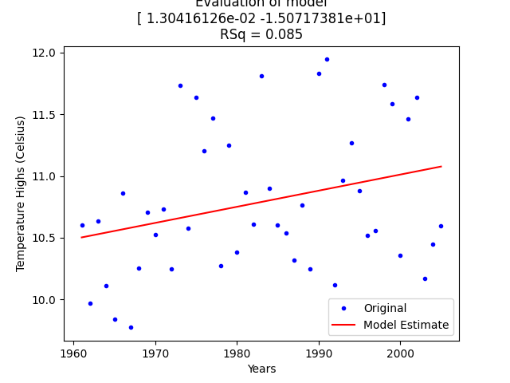
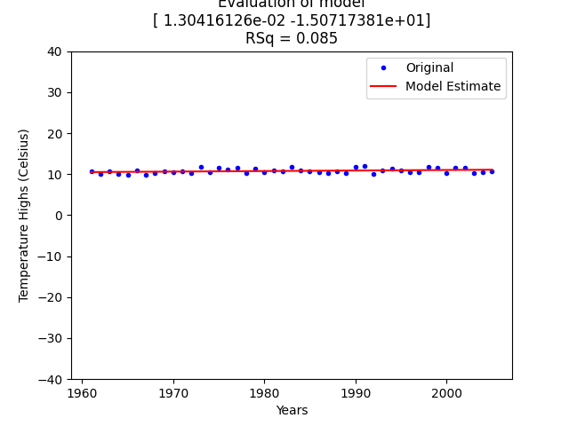

# Computational Optimization and Modelling


### pset1
*** NO VISUALS ***
<hr><br>

### pset2 
`Simulation of Standard Robot in Rectangular room`
```py
testRobotMovement(StandardRobot, RectangularRoom)
```


<hr><br>

`Simulation of Multiple Standard and RandomWalk Robot in Rectangular room`
```py
runSimulation(
    num_robots = <variable>,
    speed = 1.0,
    width = 20,
    height = 20,
    min_coverage = 0.8,
    num_trials = 20,
    robot_type = Standard & RandomWalkRobot
)
```


`Simulation of 2 Standard and RandomWalk Robot in Various shapes of Rectangular room`
```py
runSimulation(
    num_robots = 2,
    speed = 1.0,
    width = <variable>,
    height = <variable>,
    min_coverage = 0.8,
    num_trials = 200,
    robot_type = Standard & RandomWalkRobot
)
```


<hr><br>


### pset3
`Simulation without drug: SimpleVirus an Patient`

```py
simulationWithOutDrug(
    numViruses = 100, 
    maxPop = 1000, 
    maxBirthProb = 0.1, 
    clearProb = 0.05, 
    numTrials = 10
)
```



`Simulation with drug: ResistantVirus and Treated Patient`

- __Virus initially gluttagonol resistant__
```py
simulationWithDrug(
    numViruses = 100, 
    maxPop = 1000, 
    maxBirthProb = 0.1, 
    clearProb = 0.05, 
    resistances = {"guttagonol": True},
    mutProb = 0.005, 
    numTrials = 10
)
```


<br>

- __Virus initially NOT gluttagonol resistant__
```py
simulationWithDrug(
    numViruses = 100, 
    maxPop = 1000, 
    maxBirthProb = 0.1, 
    clearProb = 0.05, 
    resistances = {"guttagonol": False},
    mutProb = 0.005, 
    numTrials = 1
):
```


<hr><br>


### pset4

`Model fitting: Daily Temperature of Boston on 10th of January from 1961 to 2005`



***After Adjusting scales***


<br>

`Model fitting: Average Yearly Temperature of Boston from 1961 to 2005`



***After Adjusting scales***

